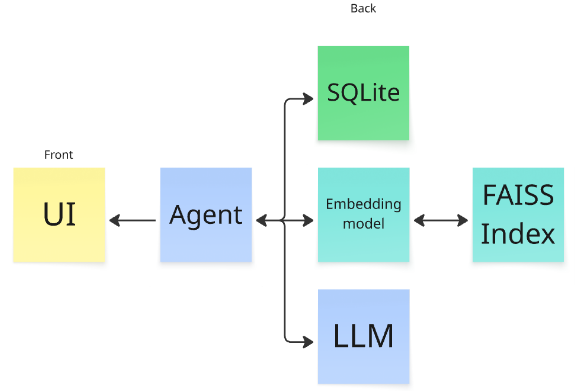
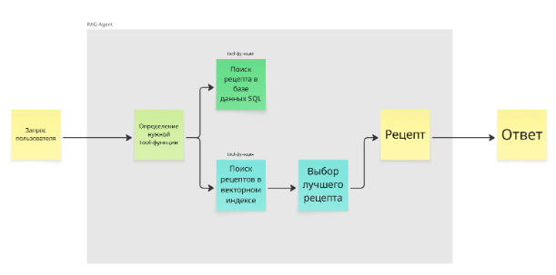

## Playful chef api

Prepare project (requires [poetry](https://python-poetry.org/docs/#installation)):

```sh
poetry install
poetry run pre-commit install
```

Prepare data: pull submodule, then convert to SQLite:

```sh
git submodule update --init --recursive
poetry run python3 data/csv_to_sqlite.py
```

Run raw python with live reload:

```sh
poetry run uvicorn playful_chef_api.main:app --reload --host 0.0.0.0 --port 8000
```

Run in podman:

```sh
poetry run podman-compose up --build -d
```

## Архитектура пайплайна
Архитектура сочетает в себе RAG и агента.



Agent - работает на базе LLM. Получает запрос пользователя с UI, определяет где необходимо искать рецепт - в SQL базе данных (SQLite) или векторном индексе (FAISS). Определение источника происходит при помощи tool-функций.

FAISS Index собран на основе TSV-файла, данные из которого использовались для наполнения SQLite.

В качестве эбеддинг-модели используется paraphrase-multilingual-MiniLM-L12-v2.

В качестве LLM используется mistral-small-latest.

## Взаимодействие компонентов


### Шаг 1 - Запрос пользователя
На вход мы получаем сообщение пользователя. Это может быть список ингредиентов - “курица, рис, морковь”, или сообщение, которое содержит примерное название блюда - “порекомендуй какой-нибудь суп на ужин”.

### Шаг 2 - Обработка запроса агентом
На этом этапе, Агент определяет - в какой месте искать ответ на вопрос пользователя. Для этого реализованы две tool-функции:
get_recipes_from_db - поиск рецептов в базе данных SQL. Метод поиска - полнотекстовый. Подходит для запросов, которые содержат в себе список ингредиентов - “курица, рис, морковь”
get_recipes_from_rag - поиск рецептов в векторной базе знаний . Метод поиска - векторный. Подходит для запросов, в которых нет явного списка ингредиентов - “порекомендуй какой-нибудь суп на ужин”, “рецепт блинов”.

### Шаг 3 - Выбор лучшего рецепт
Если поиск рецептов был произведен в векторной базе знаний, мы возвращаем k подходящих рецептов. Данный шаг является своего рода реранкером, но реализован через отдельный запрос в LLM. Такая реализация выбрана для того, чтобы уменьшить количество потребляемых ресурсов.
Мы просим LLM выбрать самый подходящий из рецепт из k - LLM, при помощи заданного Response Format выбирает номер самого подходящего рецепта.
В данный момент, этот шаг реализован только для поиска в векторной базе знаний (возможны доработки)

### Шаг 4 - Предоставление ответа
Самый релевантный рецепт возвращается пользователю. В ответе содержится название, краткое описание и ссылка на рецепт.

## Тестовый набор данных и пайплайн тестирования
Создан тестовый набор из 40 запросов, разделенных на 4 категории:
Сейчас, т.к. ретривером выступает сам генератор, а на выходе он выдает 1 рецепт (или несколько, зависит от тула), то сначала выбраны следующие метрики:
  - Явные списки ингредиентов (20 запросов): "курица, рис, морковь"
  - Вопросы "что приготовить из..." (5 запросов)
  - Запросы по названию блюда (10 запросов): "рецепт борща", "пицца"
- Категориальные запросы (5 запросов): "быстрый завтрак из яиц", "низкокалорийный ужин с семгой"

Для каждого запроса указан ожидаемый инструмент (SQL БД или RAG).

Пайплайн тестирования тестирования реализован через Python-скрипт:
1) Подгрузка тестовых данных из JSON
2) Запуск каждого запроса через агента с замером времени
3) Определение tool-а,
4) Проверка релевантности через LLM:
	- Для SQL: проверка наличия ВСЕХ указанных ингредиентов в найденном рецепте
	- Для RAG: проверка семантического сходства названия найденного блюда с запросом
5) Cравнение с ожидаемым результатом и сохранение результатов.

### Метрики качества
- Tool Selection Accuracy - процент правильно выбранных тулов (Сейчас результат: ~62,5%, порог - 70%)
- Response Success Rate - процент запросов с не пустым ответом (Сейчас результат: ~85%, порог - 90%)
- DB/RAG Tool Accuracy - точность вызов той или иной тулы (SQL поиск - 6/20 (низко), RAG - 19/20)
- DB/RAG Relevance - для SQL это процент рецептов, содержащих все ингредиенты, а для RAG - процент рецептов, название которых соответствует запросу (SQL поиск - 3/20, RAG поиск - 5/20)
